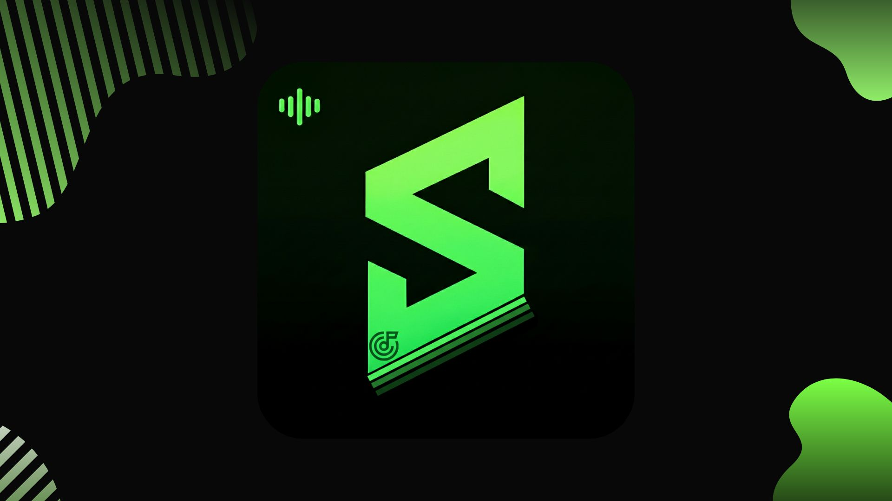
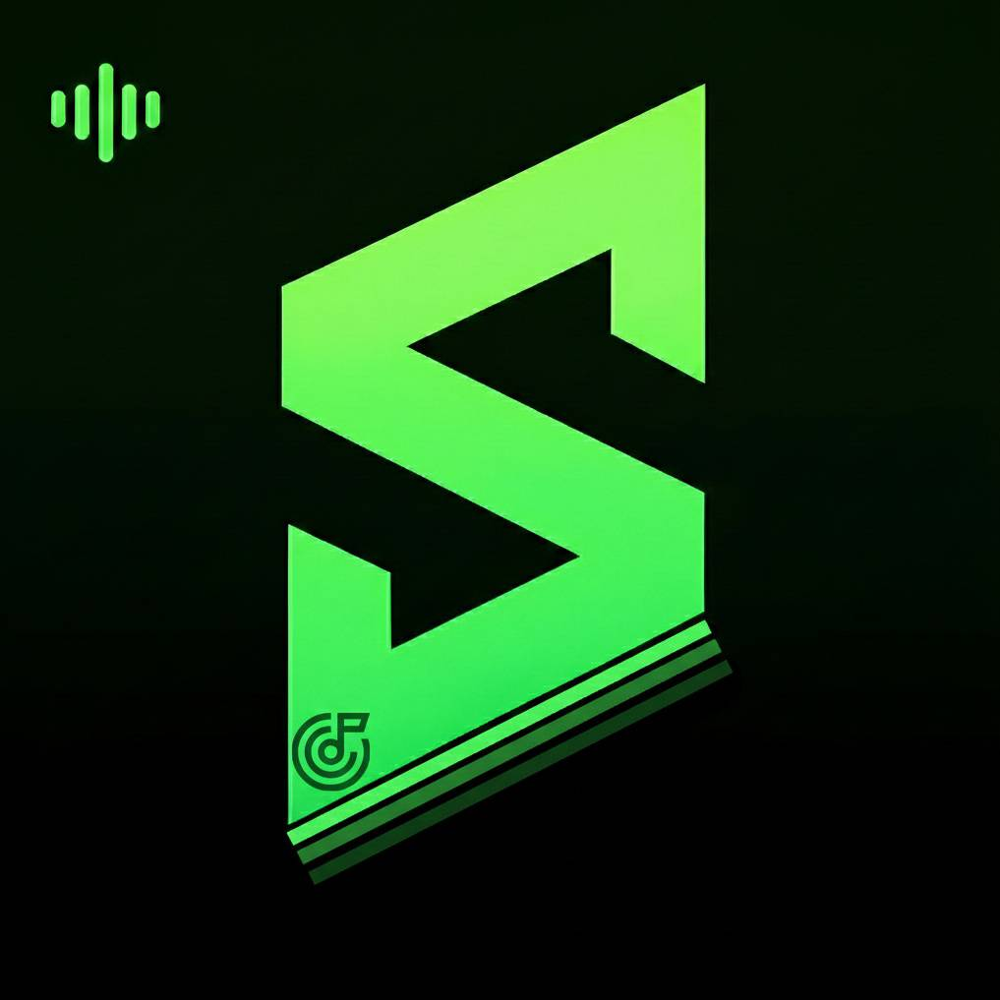

<p align="center">
  
</p>

<h1 align="center">Spottrack PC</h1>

<p align="center">
  
  
  
</p>

---

## 🎵 La nueva generación de música en PC

**Spottrack PC** es la aplicación de música para Windows desarrollada por **RAGE Studios**.  
Permite reproducir cualquier canción disponible en YouTube de forma optimizada, sin anuncios y con funciones avanzadas de listas de reproducción, “me gustas” y reproducción en segundo plano.  
Con Spottrack PC, tienes un reproductor **independiente**, moderno y potente directamente en tu escritorio.

---

## ✨ Funciones destacadas

- Reproducción de música **sin anuncios**.
- **Catálogo completo** de YouTube.
- Sistema de **cuentas**, playlists y “me gustas”.
- **Reproducción en segundo plano**.
- Interfaz moderna.
- Compatible con **Windows 7 hasta 11**.
- Sistema de reproducción con **avanzadas funciones de control**.
- Secciones nuevas y mejoradas: recientes, playlists, me gustas.

---

## 🆕 Últimas actualizaciones

**Versión 2.0.0**  
- Nuevo reproductor independiente usando **ytdl-core (propio reparado) y yt-dlp** para audio directo.  
- Mejora de calidad de audio y rendimiento general.  
- Nueva interfaz estilo Spotify con identidad visual azul oscuro.  
- Secciones nuevas: reproducciones recientes, playlists y me gustas.  
- Sistema de cuentas y sincronización de preferencias.  
- Optimización de búsqueda usando **yt-search**, sin límites ni restricciones.  
- Mayor compatibilidad y estabilidad en todas las versiones de Windows soportadas.

---

## 🔎 Comparativa versión 1.0 vs 2.0.0

| Función | Spottrack PC 1.0 | Spottrack PC 2.0.0 |
|---------|-----------------|------------------|
| Sistema de búsqueda | API oficial de YouTube | yt-search sin límites |
| Reproducción | Player oficial de YouTube | Reproductor independiente con ytdl-core (propio ) y yt-dlp |
| Audio | Limitado, depende del player | Alta calidad, sin depender del player |
| Anuncios | Presentes | Sin anuncios |
| Control | Adelantar/retroceder podía generar retrasos | Instantáneo, sin retrasos, mayor control |
| Restricciones | Descarga y reproducción limitadas, región | Sin límites ni restricciones |
| Dependencia de YouTube | 100% | Solo fuente de contenido, sistema independiente |
| Interfaz | Simple | Moderna, estilo Spotify, azul oscuro |

---

## 💾 Descargas

Descarga la versión más reciente según tu sistema operativo:

- [Spottrack-PC x64.exe](https://github.com/TU_USUARIO/Spottrack-PC/releases/download/v2.0.0/Spottrack-PC-2.0.0-x64-Setup.exe)  
- [Spottrack-PC x32.exe](https://github.com/TU_USUARIO/Spottrack-PC/releases/download/v2.0.0/Spottrack-PC-2.0.0-ia32-Setup.exe)  
- [Spottrack-PC universal](https://github.com/TU_USUARIO/Spottrack-PC/releases/download/v2.0.0/Spottrack-PC-2.0.0-x64-Setup.appx)

---

## 📝 Licencia

**Spottrack PC** es propiedad de **RAGE Studios**.  
Todos los derechos reservados 2026.  

Antes de instalar, consulta nuestra **[EULA / LICENSE.txt](LICENSE.txt)**.  
Se prohíbe expresamente:

- Modificar archivos internos del programa.  
- Distribuir o copiar el código sin autorización.  
- Usar Spottrack para propósitos distintos a los permitidos.  
- Vulnerar, hackear o alterar de cualquier forma Spottrack.  

El incumplimiento de estas reglas puede resultar en:

- Baneo global de la plataforma Spottrack.  
- Bloqueo de cuentas de usuario y Discord.  
- Acciones legales según corresponda.

---

## 📬 Contacto y soporte

- Página oficial: [Spottrack Web](https://spottrack-web.github.io)  
- Discord: [RAGE Studios Discord](https://discord.gg/kRhXAajRDq)  
- GitHub: [Spottrack-PC](https://github.com/RAGE-StudiosC/Spottrack-PC)

---

```md


